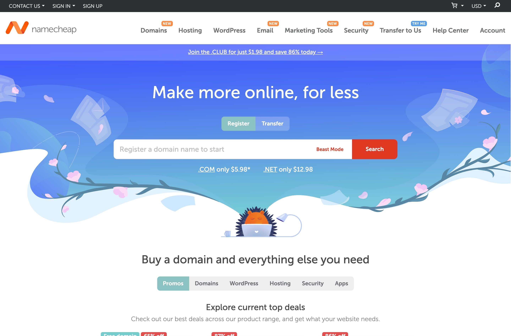

## [Namecheap](https://www.namecheap.com/): for registering your domain

I use namecheap as my primary and only domain registrar, because of its good price, simple user interface, and DNS customizability. Not much to add, but here's a quick tip: namecheap usually runs discount campaigns during festivities such as Black Friday, so those are good times to snag your preferred domains at an even lower cost.
