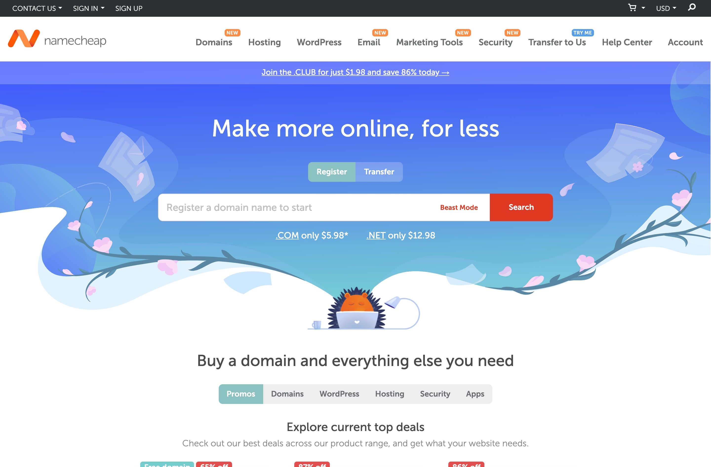

Here's a compilation of business-related tools and resources I use when working on business projects.

## [Namelix](https://namelix.com/): for coming up with business names

Namelix is a free, AI-powered business name generation tool I always go to when I'm looking to name a new project. I love it because all I have to do is input some keywords relevant to my project, choose a name style, and voila ~ the tool generates hundreds of **high-quality** business names in a design logo format. What's more, it can even display a tick on the logo if the `.com` domain for the name is currently available, and generate AI-powered feedback on why the name might be suitable for your project. A must-have tool for all entrepreneurs and indie hackers.

## [Brandmark](https://brandmark.io/): for generation of logos

Brandmark is an AI-powered logo generation tool that generates high-quality logo designs given a name, and some design style inputs. Namelix, the business name generation tool I shared above, is built by Brandmark, and the logos generated in the Namelix interface are actually from the Brandmark tool. This tool requires you to pay a one-time fee of $25 to get the logo source files, or $65 to get the logo source files and some other mockups. But if you have some design skills and are comfortable using design tools like [Figma](https://www.figma.com/), Brandmark is a perfect way to get logo design inspirations for free. 

## [Instant Domains](https://instantdomains.com/): for checking if a domain name is still available

Instant Domain Search is a domain registrar, but I use it as a domain availability checker simply because it's the fastest one I've used. Simply enter the domain name you wish to secure, and it will indicate at breakneck speed which domain extensions (e.g. `.com` or `.org`) are still available for registration. The tool also has some cool features, like generating additional domain names based on the name you keyed in and indicating their availability as well. Side note, I've experienced some cases of incongruence where the tool showed a domain was available when it was actually taken, but these cases are far and between. 

## [Namecheap](https://www.namecheap.com/): for registering your domain

I use namecheap as my primary and only domain registrar, because of its good price, simple user interface, and DNS customizability. Not much to add, but here's a quick tip: namecheap usually runs discount campaigns during festivities such as Black Friday, so those are good times to snag your preferred domains at an even lower cost.
