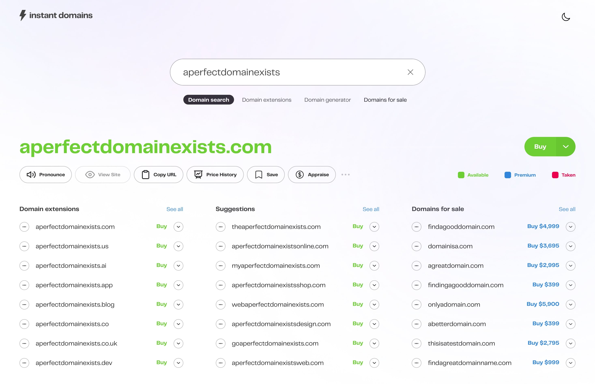
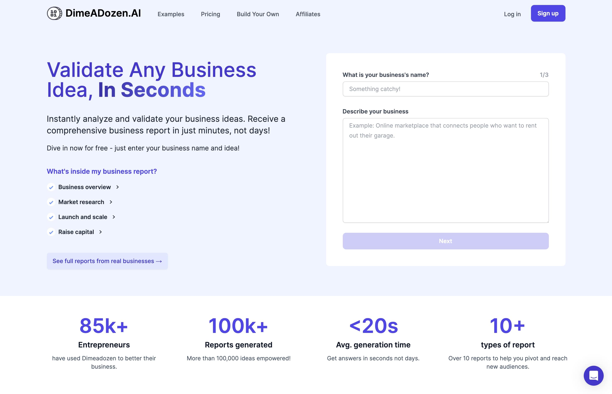

Getting started on a business project is not easy. There is an infinitely generating list of tasks to tick off the to-do list, from coming up with a business plan and name to building the product, raising funding... and the list goes on. Thankfully, there are tools others have built to make this journey a smoother ride. This compilation goes to all the self-starters and entrepreneurs who aspire to make a positive impact on people and society at large. 

### TLDR;
- [Namelix](https://namelix.com/): for coming up with business names
- [Brandmark](https://brandmark.io/): for generation of logos
- [Instant Domains](https://instantdomains.com/): for checking if a domain name is still available
- [DimeADozen](https://www.dimeadozen.ai/): for validating your business idea
- [YC Startup School](https://www.startupschool.org/): for learning how successful founders build startups
- [Startups.gallery](https://startups.gallery/): for discovering promising startups

## [Namelix](https://namelix.com/): for coming up with business names

Namelix is a free, AI-powered business name generation tool I always go to when I'm looking to name a new project. I love it because all I have to do is input some keywords relevant to my project, choose a name style, and voila ~ the tool generates hundreds of **high-quality** business names in a design logo format. What's more, it can even display a tick on the logo if the `.com` domain for the name is currently available, and generate AI-powered feedback on why the name might be suitable for your project. A must-have tool for all entrepreneurs and indie hackers.

## [Brandmark](https://brandmark.io/): for generation of logos

Brandmark is an AI-powered logo generation tool that generates high-quality logo designs given a name, and some design style inputs. Namelix, the business name generation tool I shared above, is built by Brandmark, and the logos generated in the Namelix interface are actually from the Brandmark tool. This tool charges you a one-time fee of $25 to get the logo source files, or $65 to get the logo source files and some other mockups. But if you have some design skills and are comfortable using design tools like Figma, Brandmark is a perfect way to get logo design inspirations for free. 

## [Instant Domains](https://instantdomains.com/): for checking if a domain name is still available

Instant Domain Search is a domain registrar, but I use it as a domain availability checker simply because it's the fastest one I've used.  Simply enter the domain name you wish to secure, and it will indicate at breakneck speed which domain extensions (e.g. `.com` or `.org`) are still available for registration. The tool also has some cool features, like generating additional domain names based on the name you keyed in and indicating their availability as well. Side note, I've experienced some cases of incongruence where the tool showed a domain was available when it was actually taken, but these cases are far and between. And for those curious, the domain registrar I use for my website/app deployments is Namecheap.

## [DimeADozen](https://www.dimeadozen.ai/): for validating your business idea

The surest way to fail in your startup is to fail to test and validate your startup idea before hitting the market. Validating your startup idea takes a lot of work. You'd have to plough through the internet looking for evidence and statistics that the problem your startup is solving is not only a real problem people face but also a substantial one that people would be willing to pay to resolve. You'd have to check if the total addressable market is large enough for it to be worth the effort of building the product, and who the current competitors in the space are. 

DimeADozen is an AI-powered business validation tool I use to make this process efficient and seamless. All you have to do is input some details about your business idea, and it will generate a business report going through useful metrics such as business viability, potential risks and trends in the market sector. Note that as the report is fully AI-generated, there is an inherent risk of the AI hallucinating, but so far I've found the reports I generate to be pretty accurate. I use the report to fast-track my business validation process, and in my experience, I've found the free plan to be more than substantial for my needs.

## [YC Startup School](https://www.startupschool.org/): for learning how successful founders build startups

YCombinator is probably the world's most prestigious and well-known venture capital fund. It has invested in and incubated the world's most successful startups, such as Airbnb, Dropbox, Stripe, Coinbase and Reddit. And now they've built a startup school featuring a course teaching founder-wannabes how to build a startup step-by-step. **For free.**

Having gone through 50% of the course, I must say I love the content they are putting out. It's super relevant, and they point out a lot of blind spots that first-time founders often have. Startup School also has a free co-founder matching program, where founders go looking for co-founders. I haven't used it personally, but it may come in handy one day.

## [Startups.gallery](https://startups.gallery/): for discovering promising startups

Startups.gallery is 'a deeply curated gallery of outstanding early-stage companies', as the creators put it. I use this site to search for new apps (yes, I'm an app junkie), and to learn more about what the most successful founders in the world are currently building. It's a great place to look for business ideas as well.

---

Hope this compilation was useful. Cheers!